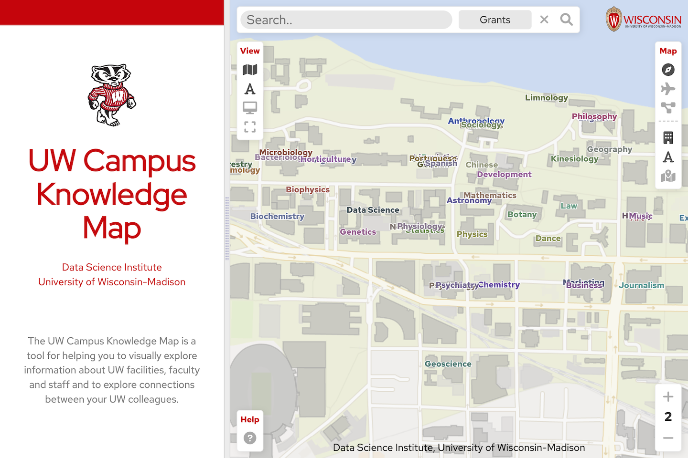
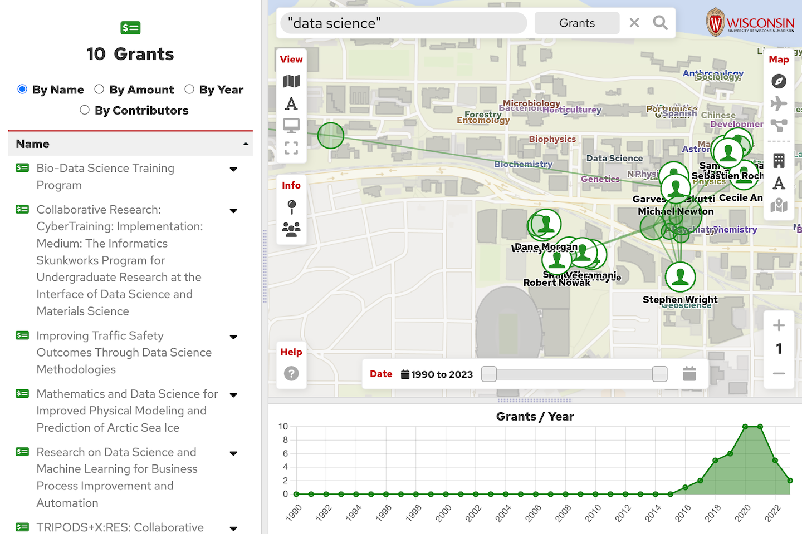

	

		
	

# Academic Data Server

This is a server application / API for managing academic data.  It allows storing and retreiving data about university people and activities such as grants, articles, and patents.

## Applications
This data server is used in the [University of Wisconsin Campus Knowledge Map](http://datascience.sharedigm.com/cmap).

	

		
		

			<label>UW Campus Knowledge Map</label>
		

	

	

		
		

			<label>Example UW Campus Knowledge Map Search Results</label>
		

	

## Documentation
The API routes that are implemented by this data server are described in the
[Academic Data API Reference](docs/academic_data_api_reference.pdf).

## Requirements

- PHP 8.0
- A SQL Database (MySql or MariaDB)

## Configuration

Before running these scripts, you will need to first create a database to store the information.

1. Create a database

First, you'll want to create a database to store the information.  The database schema that is used for this utility is located in the file: [database/academic_data_structure.sql](database/academic_data_structure.sql).

2. Configure your web server

Since this is a web server application, you will need to configure your web server to run it.  Please see the documentation for your particular type of web server ([Apache](https://httpd.apache.org), [Nginx](https://www.nginx.com), etc.) for details.

3. Configure the .env file

Next, you'll need to configure the academic data server to connect with your database.  This application is built on top of the [Laravel](https://laravel.com) framework, so please see the [Laravel documentation](https://laravel.com/docs/10.x/configuration) for details.

<!-- LICENSE -->
## License

Distributed under the MIT License. See the [license](./LICENSE.txt) for more information.

## Credits

This project was funded by the [American Family Insurance Data Science Institute](https://datascience.wisc.edu) at the [Univeristy of Wisconsin-Madison](https://www.wisc.edu)
